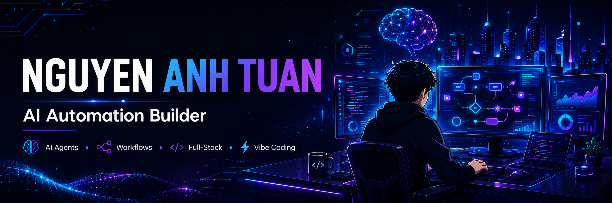

  

 
# 
Hi 👋, I'm Nguyễn Anh Tuấn

 

---

## 🚀 About Me

I'm passionate about building practical AI systems that automate real work.

* 🤖 Building AI Agents & Automation Systems
* ⚡ Creating workflows that save time and effort
* 💻 Full-stack development with JavaScript
* 🚀 Turning ideas into real products
* 🌱 Exploring Agentic AI, Automation, SaaS and AI Workflows

---

## 🛠️ Tech Stack

### Languages & Frameworks

  

### Tools

---

## 🤖 AI & Automation

---

## 📊 GitHub Statistics

---

## 🔥 Contribution Streak

---

## 🎯 Current Focus

* 🤖 AI Agents
* ⚡ Workflow Automation
* 🧠 Agentic AI Systems
* 💻 Full-Stack Development
* 🚀 Building Useful Products

---

## 📌 Featured Projects

### 🤖 AI Automation

* AI Agents
* Workflow Automation
* Chatbots & Assistants

### 🌐 Web Development

* JavaScript Applications
* Node.js APIs
* Frontend Interfaces

### 🚀 Product Building

* SaaS Experiments
* Internal Tools
* Productivity Systems

---

## 📫 Connect With Me

---

### 💭 Building useful things with AI, automation and code.

